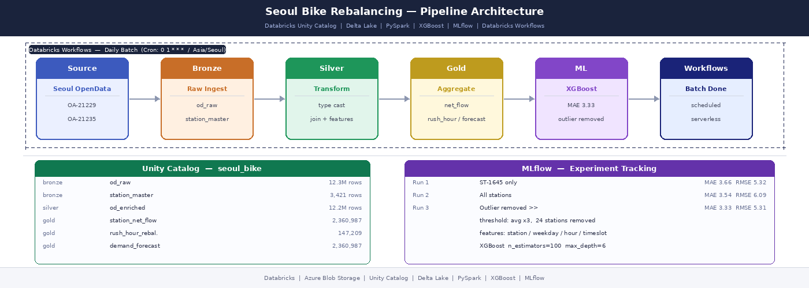
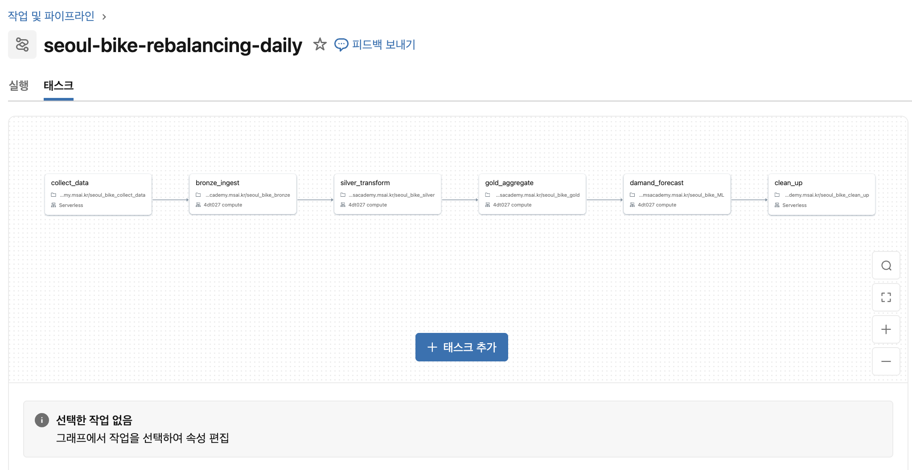
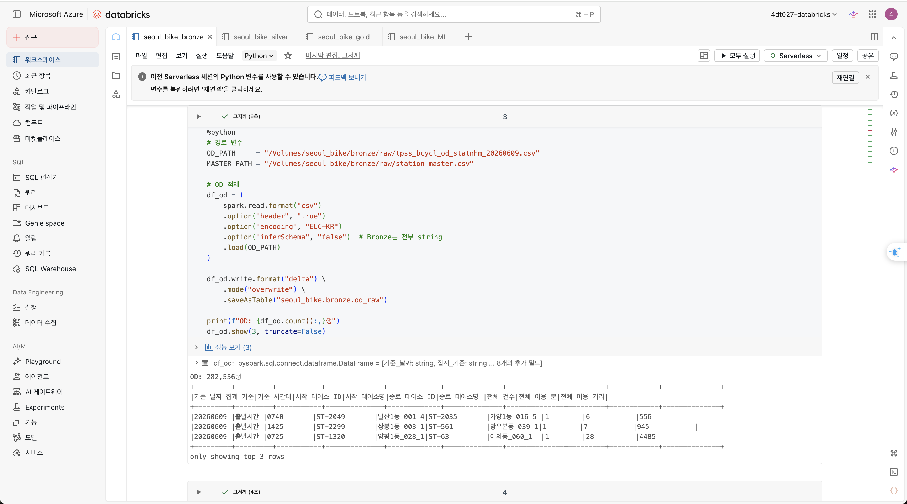
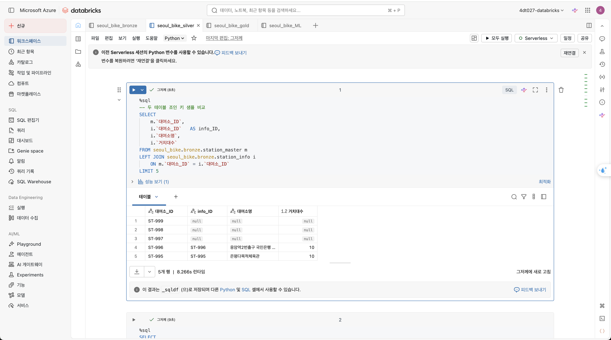
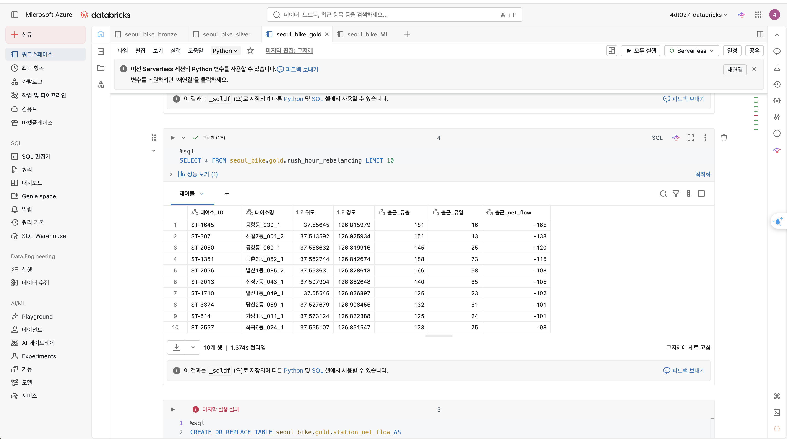
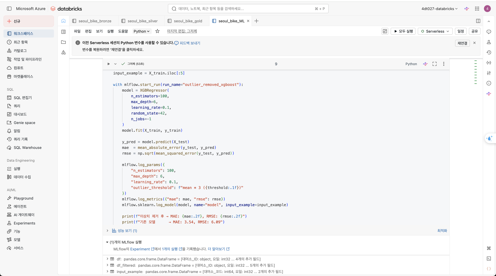
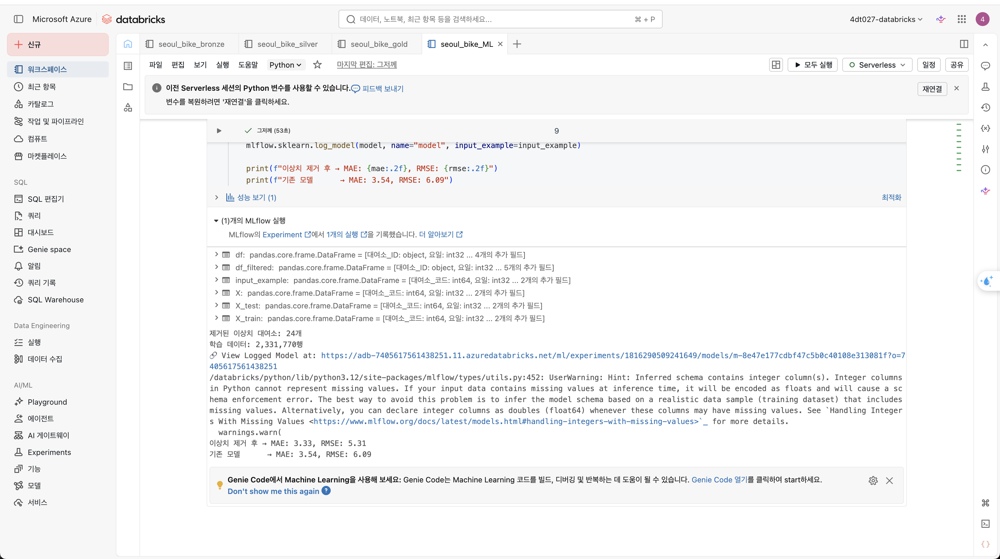
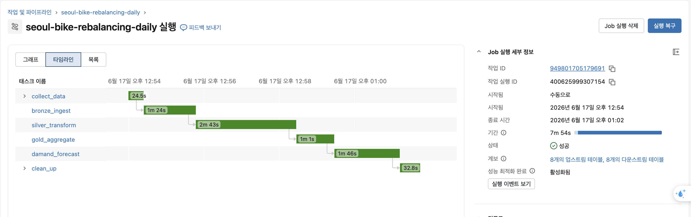

# Seoul Bike Rebalancing — 따릉이 재배치 우선순위 분석

    

서울 따릉이 OD 데이터를 Databricks 메달리온 아키텍처로 처리하고,
XGBoost 수요 예측 모델로 출근 시간대 자전거 부족 대여소를 사전 탐지하는 데이터 파이프라인.

---

## 개요

출근 시간대 특정 따릉이 대여소는 자전거가 빠르게 소진되어 이용 불가 상태가 된다.
재배치 트럭이 출발하기 전에 "어느 대여소에 먼저 자전거를 갖다 놓아야 하는가"를
1,230만 건의 OD 데이터와 머신러닝으로 답하는 것이 이 프로젝트의 목표다.

---

## 목표

- Databricks Unity Catalog 기반 메달리온 아키텍처(Bronze → Silver → Gold) 구현
- 1,230만 행 OD 데이터를 PySpark + Databricks SQL로 처리
- XGBoost + MLflow로 대여소별 시간대 수요 예측 및 실험 추적
- Databricks Workflows로 6-Task 배치 파이프라인 자동화 (매월 1일)
- 출근 시간대 재배치 우선순위 Top 10 도출로 운영 의사결정 지원

---

## 아키텍처



Databricks Workflows DAG:


---

## 데이터

| 데이터셋 | 출처 | 내용 |
|---|---|---|
| OD 승객수 | 서울 열린데이터광장 OA-21229 | 대여소간 이동 건수, 5분 단위, 약 1,230만 행 |
| 대여소 마스터 | OA-21235 | 대여소 ID, 위도, 경도, 3,421행 |

---

## 메달리온 계층

### Bronze



- OD CSV(EUC-KR) + 대여소 마스터를 Databricks Unity Catalog Delta 테이블로 적재
- XLSX 헤더 5행 구조 → pandas `skiprows=5` + 수동 컬럼 매핑
- 원본 보존 원칙: 모든 컬럼 string 타입 저장

### Silver



- 타입 캐스팅: `기준_날짜` → DATE, `기준_시간대` → INT
- 시간 추출: `FLOOR(기준_시간대 / 100)` → hour
- `station_master` LEFT JOIN × 2 → 위도·경도 부착
- 파생 컬럼: `요일`, `시간대_구분`(출근/퇴근/심야/기타), `이동거리_km`, `평균속도_kmh`

### Gold



| 테이블 | 내용 | 행 수 |
|---|---|---|
| `station_net_flow` | 대여소 × 날짜 × 시간대별 유출/유입/net_flow | 2,360,987 |
| `rush_hour_rebalancing` | 출근(7~9시) 재배치 우선순위 | 147,209 |
| `demand_forecast` | XGBoost 예측 결과 (실제 vs 예측) | 2,360,987 |

---

## ML — 수요 예측

모델: XGBoost Regressor
피처: 대여소_코드(LabelEncoding), 요일, hour, 시간대_코드
타겟: 대여소별 시간대 유출량

### MLflow 실험 결과





| Run | MAE | RMSE | 비고 |
|---|---|---|---|
| ST-1645 단독 | 3.66 | 5.32 | 단일 대여소 검증 |
| 전체 대여소 | 3.54 | 6.09 | 2,360,987행 학습 |
| 이상치 제거 | 3.33 | 5.31 | 24개 대여소 제거 후 |

이상치 기준: 대여소별 평균 유출이 전체 평균(5.5대)의 3배 초과.
ST-1718(방화1동_041_1) 평균 유출 30.8대(전체 평균의 6배) → 예측 오차 209대 발생.
24개 제거 후 MAE 3.54 → 3.33으로 개선.

---

## 재배치 우선순위 Top 5 (출근 시간대)

| 순위 | 대여소 | 출근 net_flow |
|---|---|---|
| 1 | 공항동_030_1 | -165 |
| 2 | 신길7동_001_2 | -138 |
| 3 | 공항동_060_1 | -120 |
| 4 | 등촌3동_052_1 | -115 |
| 5 | 발산1동_035_2 | -108 |

강서구·영등포구 일대가 출근 시간 자전거 순유출 집중 지역.

---

## Databricks Workflows 배치 자동화

매월 1일 새벽 1시 자동 실행 (`Cron: 0 1 1 * *`):



| Task | 소요 시간 | 내용 |
|---|---|---|
| `collect_data` | 24.5s | 전월 OD 파일 준비 |
| `bronze_ingest` | 1m 24s | Delta 테이블 적재 |
| `silver_transform` | 2m 43s | 정제 + 조인 |
| `gold_aggregate` | 1m 1s | net_flow 집계 |
| `demand_forecast` | 1m 46s | XGBoost 재학습 + MLflow 기록 |
| `clean_up` | 32.8s | 6개월 이상 파일 삭제 |

---

## 트러블슈팅

| 문제 | 원인 | 해결 |
|---|---|---|
| station_info 47% 미매칭 | 두 파일 갱신 시점 불일치 | station_master 단독 사용으로 전환 |
| hour = 7.4 (float) | 정수 나눗셈 미처리 | `FLOOR(기준_시간대 / 100)` |
| XLSX 헤더 파싱 실패 | 헤더 5행 구조 | `skiprows=5` + 수동 컬럼 매핑 |
| 한글 컬럼명 SQL 오류 | Databricks SQL 문법 | 백틱(`` ` ``) 처리 |
| ST-1718 예측 오차 209 | 평균 유출 전체의 6배 | 이상치 기준(avg×3) 설정, 24개 제거 |

---

## 기술 스택

🔷 Azure Databricks (Unity Catalog, Delta Lake, Workflows)
🐍 PySpark / Databricks SQL
🌲 XGBoost + MLflow
☁️ Azure Blob Storage

---

## 폴더 구조

```
seoul-bike-rebalancing/
├── README.md
├── requirements.txt
├── notebooks/
│   ├── seoul_bike_collect_data.py
│   ├── seoul_bike_bronze.py
│   ├── seoul_bike_silver.py
│   ├── seoul_bike_gold.py
│   └── seoul_bike_clean_up.py
├── ml/
│   └── seoul_bike_ML.py
├── data/                          # .gitignore 처리 (대용량)
│   ├── 202603/
│   ├── 202604/
│   ├── 202605/
│   ├── od_merged_3months.csv
│   ├── station_master.csv
│   └── station_info.xlsx
└── screenshots/
    ├── bike_bronze.png
    ├── bike_silver.png
    ├── bike_gold.png
    ├── bike_ml.png
    ├── bike_ml2.png
    └── workflow.png
```

---

## 데이터 출처

- 서울 열린데이터광장: [data.seoul.go.kr](https://data.seoul.go.kr)
  - OA-21229: 공공자전거 이용정보(대여소간 OD)
  - OA-21235: 공공자전거 대여소 마스터 정보
